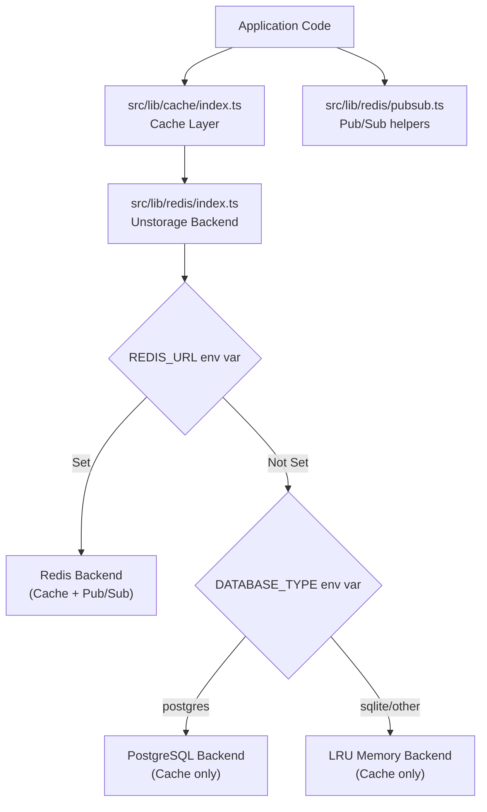

# Phase 7.1: Redis & Cache Implementation Plan (Unstorage-backed)

## Overview

Implement a unified cache and storage layer using **Unstorage** with multiple backend support. This enables high-performance caching and Pub/Sub capabilities (via Bun native Redis) while providing fallback mechanisms for different environments.

## Architecture

## File Changes Summary

| File                               | Action     | Purpose                                                      |
| ---------------------------------- | ---------- | ------------------------------------------------------------ |
| `src/lib/redis/index.ts`           | **Create** | Unstorage driver configuration (Redis/Postgres/LRU)          |
| `src/lib/redis/pubsub.ts`          | **Create** | Bun native Redis Pub/Sub implementation (requires REDIS_URL) |
| `src/lib/cache/index.ts`           | **Create** | High-level cache API (get/set/delete/clear)                  |
| `src/routes/api/modules/-redis.ts` | **Create** | Health check and status monitoring for storage               |
| `test/lib/redis/redis.test.ts`     | **Create** | Unit tests for storage backends                              |
| `test/lib/redis/pubsub.test.ts`    | **Create** | Unit tests for Pub/Sub functionality                         |
| `.e2e/api/redis-health.spec.ts`    | **Create** | E2E test for storage health monitoring                       |

## Implementation Details

### 1. Unified Storage (`src/lib/redis/index.ts`)

Uses Unstorage to create a driver-agnostic storage instance:

- **Redis**: Primary backend when `REDIS_URL` is provided.
- **PostgreSQL**: Secondary backend when `DATABASE_TYPE=postgres`.
- **Memory**: Fallback LRU cache for development/SQLite.

### 2. Pub/Sub (`src/lib/redis/pubsub.ts`)

Utilizes Bun's built-in `RedisClient` for high-performance messaging:

- **Typed Channels**: Prevents typos and ensures message structure.
- **Dedicated Subscriber**: Uses a separate connection for blocking operations.
- **Graceful Degradation**: Pub/Sub features are disabled when Redis is unavailable.

### 3. Cache API (`src/lib/cache/index.ts`)

Provides a simplified interface for application-wide caching:

- Standard `get`, `set`, `removeItem` methods.
- Namespace support for avoiding collisions.
- Built-in TTL support (where supported by backend).

## Verification Plan

### Automated Tests

- **Unit**: Verify driver selection logic and basic CRUD operations.
- **Pub/Sub**: Test message delivery across channels (requires Redis).
- **E2E**: Check health status reporting in the monitoring dashboard.

### Manual Verification

- Verify Redis connection in Docker environment.
- Check logs for proper backend initialization.

## Status: COMPLETED

All tasks in this phase have been implemented and verified.